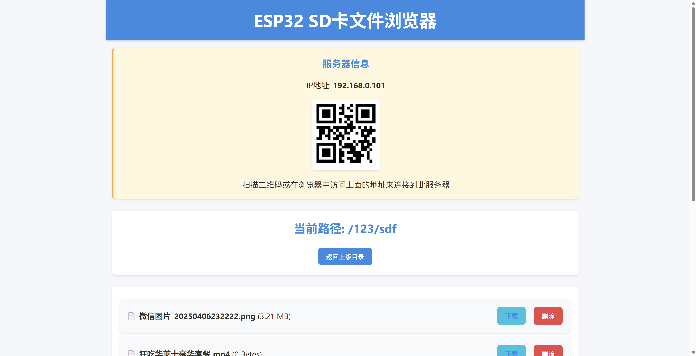
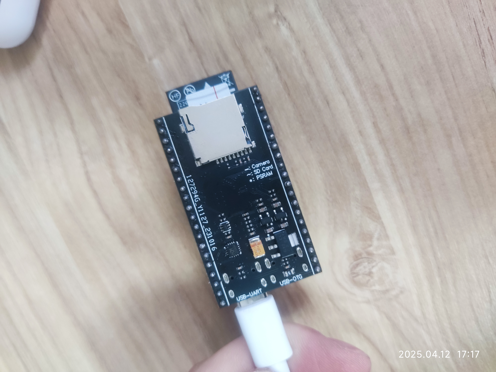
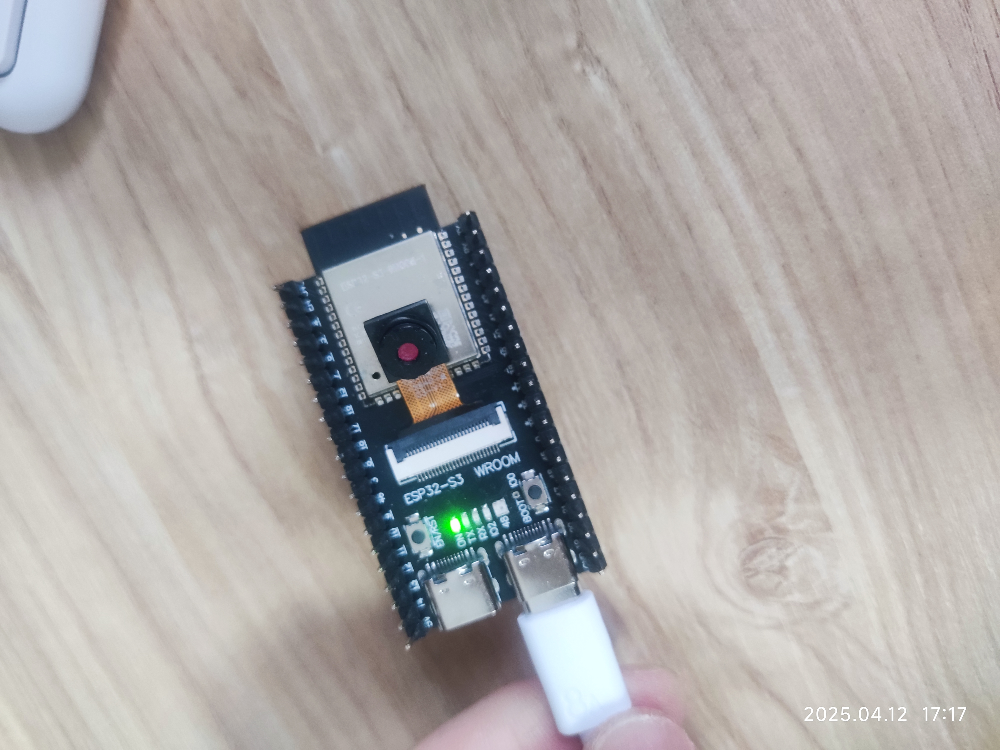

# ESP32-S3 SD Card Web Explorer

## 项目概述

ESP32-S3 SD Card Web Explorer 是一个基于 ESP32-S3 microcontroller 的 SD 卡文件系统 Web 浏览器和管理工具。该项目允许用户通过 Wi-Fi 连接到 ESP32，并使用网页界面访问、管理和操作连接到设备的 SD 卡上的文件和目录。


ESP32-S3图片：



## 功能特点

- 🌐 基于网页的文件浏览器界面
- 📁 文件和目录浏览
- ⬆️ 文件上传（支持进度条显示）
- ⬇️ 文件下载
- ❌ 文件和目录删除
- 📂 创建新目录
- 📱 响应式设计，适合移动设备和桌面设备
- 📊 实时显示上传进度
- 🔄 自动刷新文件列表
- 📝 显示文件大小和类型信息
- 📍 导航路径支持
- 🔍 二维码快速访问

## 硬件要求

- ESP32-S3 开发板（如 ESP32-S3-DevKitC-1）
- microSD 卡及适配器（连接至 ESP32-S3）
- 电源（通过 USB 或外部电源）

## 引脚连接

SD卡与ESP32-S3的连接方式：

| SD卡引脚 | ESP32-S3引脚 |
|----------|-------------|
| CMD      | GPIO38      |
| CLK      | GPIO39      |
| D0       | GPIO40      |
| VCC      | 3.3V        |
| GND      | GND         |

## 软件依赖

- Arduino Framework
- ESPAsyncWebServer 库
- ArduinoJson 库
- ESP32 Arduino Core
- windows需要下载[bonjour打印机驱动](https://support.apple.com/en-us/106380)

## 安装与使用

1. 克隆此仓库
   ```
   git clone 名字
   ```

2. 使用 PlatformIO 打开项目
   
3. 创建 `src/secrets.h` 文件并定义 WiFi 凭据
   ```cpp
   #define ssid "your_wifi_ssid"
   #define password "your_wifi_password"
   ```

4. 编译并上传项目到 ESP32-S3 开发板

5. 打开串口监视器 (115200 baud) 查看设备 IP 地址

6. 在浏览器中访问设备 IP 地址或 `http://esp32.local/`（如果 mDNS 可用）

## 自定义设置

若要修改默认设置，请编辑 `src/main.cpp` 文件中的以下定义：

```cpp
#define SD_MMC_CMD 38 // SD卡命令引脚
#define SD_MMC_CLK 39 // SD卡时钟引脚
#define SD_MMC_D0 40  // SD卡数据引脚
#define STATUS_LED 2  // 状态LED引脚
```

## 故障排除

- **SD卡无法初始化**：检查连接线路，确保SD卡正常工作，尝试格式化SD卡为FAT32
- **无法连接WiFi**：检查凭据是否正确，确保ESP32在WiFi覆盖范围内
- **文件上传失败**：检查SD卡是否有足够空间，确保文件名不包含特殊字符

## 许可证

此项目基于 MIT 许可证开源

## 致谢

- 部分代码参考了 Freenove 的示例
